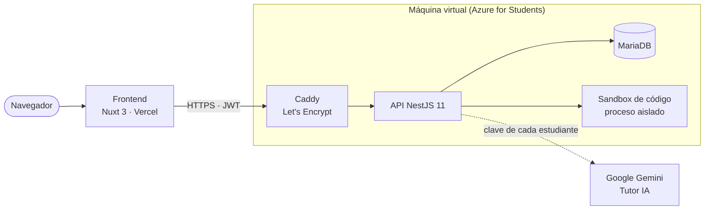

<div align="center">

# STIRE-Soft

**Sistema Tutor Inteligente con Repetición Espaciada para aprender Algoritmia**

Practica con ejercicios que se califican al instante, repasa justo antes de olvidar y pide ayuda a un
tutor que te orienta sin darte la respuesta.

[**Abrir la aplicación →**](https://stire-soft.vercel.app) &nbsp;·&nbsp;
[Documentación](docs/README.md) &nbsp;·&nbsp;
[Entregas del curso DDSE3](docs/curso-ddse3/README.md) &nbsp;·&nbsp;
[Bitácora de la semana](MONITOREO_SEMANAL.md)


Universidad de Córdoba · Departamento de Informática Educativa · Diseño y Desarrollo de Software Educativo III · 2026-2

</div>

---

## Qué hace

| Estudiante | Docente | Administrador |
|---|---|---|
| Se une a una clase con un código, lee la lección de cada unidad y resuelve **7 tipos de ejercicio** (código, opción múltiple, completar código, clasificar, emparejar, ordenar bloques y HTML/CSS). | Arma el curso por **módulos, temas y unidades**, escribe las lecciones, crea los ejercicios y sigue a cada estudiante: dominio, entregas y alertas de rezago. | Gestiona usuarios y roles, aprueba a los docentes, restablece contraseñas y ve el estado real del servidor. |
| El sistema mide su **dominio** por unidad, le programa **repasos** con el algoritmo SM-2 y le recomienda qué hacer después. | Configura el **Tutor IA** de su clase: si está activo, hasta dónde puede ayudar y con qué estilo. | Revisa los registros del sistema y los parámetros del sandbox. |

<p align="center">
  
  
</p>

Más capturas en [`docs/material-visual/`](docs/material-visual/README.md).

## Cómo está construido



| Capa | Tecnología |
|---|---|
| Frontend | Nuxt 3 (Vue 3, TypeScript), Pinia, Tailwind CSS, CodeMirror 6, Lucide |
| Backend | NestJS 11, TypeORM, MariaDB, JWT, class-validator |
| Evaluación | Motor por estrategias (un evaluador por tipo de ejercicio); el código del estudiante corre en un proceso del sistema operativo con límites de tiempo, memoria y salida |
| Aprendizaje | Dominio por unidad, repetición espaciada SM-2, recomendación del siguiente paso |
| Tutor IA | Google Gemini con la clave de cada estudiante (ADR 10), sin entregar la solución |
| Seguridad | Autenticación global por defecto, roles, saneado HTML con DOMPurify, límites de peticiones, CORS estricto |
| Despliegue | Docker Compose + Caddy en Azure; frontend estático en Vercel ([guía](docs/DESPLIEGUE.md)) |

## Probarlo en tu computador

Requisitos: **Node 24** y una base MySQL/MariaDB (o `docker compose up -d mysql`).

```bash
npm ci                      # dependencias exactas del package-lock.json
cp .env.example .env        # completar DB_*, JWT_SECRET y CORS_ORIGIN
npm run migration:run       # crea el esquema desde cero
npm run db:seed:demo        # datos de demostración (se puede repetir sin duplicar)
npm run start:dev           # API en http://localhost:3001 · Swagger en /docs

cd frontend-nuxt
npm ci
npm run dev                 # aplicación en http://localhost:3000
```

Cuentas de demostración que crea `db:seed:demo` (contraseña `Demo1234!`): `docente.demo@stire.local`
y `estudiante1.demo@stire.local` a `estudiante3.demo@stire.local`.

## Calidad

```bash
npm run build && npm test   # compila y corre las 730 pruebas (77 suites)
npm run verify:clean        # de cero: npm ci → migraciones → seed → build → arranque → login real
```

Las reglas de ingeniería del proyecto (sin `as any`, sin test no hay arreglo, `verify:clean` al cerrar
cada ola) están en [`CLAUDE.md`](CLAUDE.md). El historial de cambios, con su evidencia, en
[`CHANGELOG.md`](CHANGELOG.md).

## Estructura del repositorio

```
├── src/                 API NestJS: un módulo por dominio (auth, class, learning-unit, submissions,
│                        evaluation-engine, judge-engine, review-schedules, tutor, analytics…)
├── frontend-nuxt/       Aplicación web (páginas por rol: estudiante/, docente/, admin/)
├── docs/                Documentación: índice en docs/README.md
│   ├── curso-ddse3/     Entregas del curso: qué pidió el docente y dónde está cada cosa
│   ├── modesec/         Diseño educativo y multimedial (MODESEC Fase I y II)
│   ├── investigacion/   Tesis de pregrado: matriz bibliográfica, fichas y entregables
│   ├── seguimiento/     Bitácoras semanales cerradas y evidencias
│   └── …                Arquitectura, ADR, despliegue, calidad, material visual
├── deploy/              Caddy, copia de seguridad y configuración del correo del servidor
├── scripts/             verify-clean, datos de demostración y comprobaciones
├── test/                Pruebas de punta a punta
├── MONITOREO_SEMANAL.md Bitácora de la semana en curso (exigida en la raíz por el curso)
├── CHANGELOG.md         Historial de cambios con evidencia
└── CLAUDE.md            Reglas de trabajo del proyecto
```

## Equipo

| Integrante | Rol |
|---|---|
| **Jeider Gómez** · [@Jeider-Gomez](https://github.com/Jeider-Gomez) | Líder técnico: frontend, backend, Tutor IA y despliegue |
| **Pedro Romero** · [@pedrorm20](https://github.com/pedrorm20) | Documentación, bitácora y seguimiento |
| **José López** · [@JoseTheGoat90](https://github.com/JoseTheGoat90) | UI/UX, identidad visual y pruebas con usuarios |
| **Julio Galvis** · [@jcg0912](https://github.com/jcg0912) | Diseño instruccional: MODESEC, navegación y contenidos |
| **Jorge Cervantes** · [@IvanGoats](https://github.com/IvanGoats) | Gestión y calidad: QA funcional y de la API |

Docente: **Dr. Raúl Emiro Toscano Miranda** · Departamento de Informática Educativa, Universidad de Córdoba.

---

<sub>Proyecto académico de la Universidad de Córdoba. Todavía no tiene una licencia de código abierto declarada.</sub>
